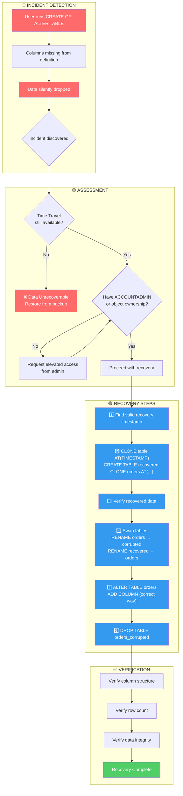
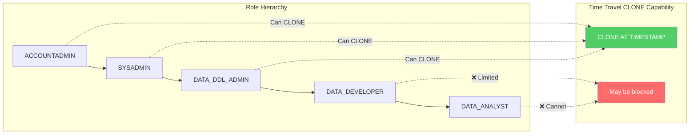
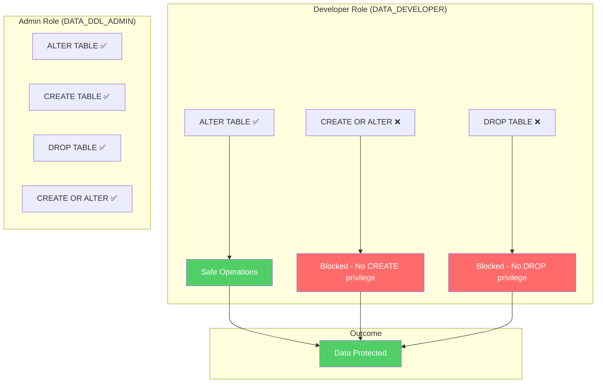

# Recovery Flow Diagram

> **Author:** Malaya Kumar Padhi (Malay)  
> Snowflake | Data Architecture | Data Engineering | Analytics Architecture | (Principal Data Architect – Aspirational)  
> **Repository:** https://github.com/Techy-Malay/snowflake-data-recovery-guide  
> **Created:** 2026-02-22

---

## Data Recovery Process: CREATE OR ALTER TABLE Incident

### ASCII Diagram

```
┌─────────────────────────────────────────────────────────────────────────────┐
│                           INCIDENT DETECTION                                │
├─────────────────────────────────────────────────────────────────────────────┤
│                                                                             │
│    User runs CREATE OR ALTER TABLE                                          │
│                    │                                                        │
│                    ▼                                                        │
│    Columns missing from definition                                          │
│                    │                                                        │
│                    ▼                                                        │
│    [!] Data silently dropped                                                │
│                    │                                                        │
│                    ▼                                                        │
│            Incident discovered                                              │
│                                                                             │
└────────────────────┬────────────────────────────────────────────────────────┘
                     │
                     ▼
┌─────────────────────────────────────────────────────────────────────────────┐
│                             ASSESSMENT                                      │
├─────────────────────────────────────────────────────────────────────────────┤
│                                                                             │
│              Time Travel still available?                                   │
│                    │                                                        │
│           ┌───────┴───────┐                                                 │
│           │               │                                                 │
│          NO              YES                                                │
│           │               │                                                 │
│           ▼               ▼                                                 │
│    [X] UNRECOVERABLE    Have ACCOUNTADMIN or                                │
│    Restore from backup  object ownership?                                   │
│                               │                                             │
│                        ┌──────┴──────┐                                      │
│                        │             │                                      │
│                       NO            YES                                     │
│                        │             │                                      │
│                        ▼             │                                      │
│               Request elevated       │                                      │
│               access from admin ─────┘                                      │
│                                                                             │
└────────────────────┬────────────────────────────────────────────────────────┘
                     │
                     ▼
┌─────────────────────────────────────────────────────────────────────────────┐
│                           RECOVERY STEPS                                    │
├─────────────────────────────────────────────────────────────────────────────┤
│                                                                             │
│    [1] Find valid recovery timestamp                                        │
│        (Query ACCOUNT_USAGE.QUERY_HISTORY)                                  │
│                    │                                                        │
│                    ▼                                                        │
│    [2] CLONE table from BEFORE the damage                                   │
│        CREATE TABLE orders_recovered CLONE orders                           │
│        AT(TIMESTAMP => '...')                                               │
│                    │                                                        │
│                    ▼                                                        │
│    [3] Verify recovered data                                                │
│        SELECT * FROM orders_recovered                                       │
│                    │                                                        │
│                    ▼                                                        │
│    [4] Swap tables                                                          │
│        RENAME orders → orders_corrupted                                     │
│        RENAME orders_recovered → orders                                     │
│                    │                                                        │
│                    ▼                                                        │
│    [5] ALTER TABLE orders ADD COLUMN (correct way)                          │
│                    │                                                        │
│                    ▼                                                        │
│    [6] DROP TABLE orders_corrupted                                          │
│                                                                             │
└────────────────────┬────────────────────────────────────────────────────────┘
                     │
                     ▼
┌─────────────────────────────────────────────────────────────────────────────┐
│                           VERIFICATION                                      │
├─────────────────────────────────────────────────────────────────────────────┤
│                                                                             │
│    [✓] Verify column structure (DESC TABLE)                                 │
│                    │                                                        │
│                    ▼                                                        │
│    [✓] Verify row count (SELECT COUNT(*))                                   │
│                    │                                                        │
│                    ▼                                                        │
│    [✓] Verify data integrity (spot check values)                            │
│                    │                                                        │
│                    ▼                                                        │
│    [SUCCESS] Recovery Complete                                              │
│                                                                             │
└─────────────────────────────────────────────────────────────────────────────┘

WHY CLONE, NOT UNDROP?
┌─────────────────────────────────────────────────────────────────────────────┐
│  CREATE OR ALTER modifies table IN PLACE - it does NOT drop the table.      │
│  Since the table was never dropped, UNDROP will NOT work.                   │
│  Use Time Travel CLONE to recover data from before the change.              │
└─────────────────────────────────────────────────────────────────────────────┘
```

### Mermaid Diagram



## Privilege Requirements Flow

### ASCII Diagram

```
┌─────────────────────────────────────────────────────────────────────────────┐
│                           ROLE HIERARCHY                                    │
├─────────────────────────────────────────────────────────────────────────────┤
│                                                                             │
│    ACCOUNTADMIN ──► SYSADMIN ──► DATA_DDL_ADMIN ──► DATA_DEVELOPER          │
│                                                            │                │
│                                                            ▼                │
│                                                     DATA_ANALYST            │
│                                                                             │
├─────────────────────────────────────────────────────────────────────────────┤
│                    TIME TRAVEL CLONE CAPABILITY                             │
├─────────────────────────────────────────────────────────────────────────────┤
│                                                                             │
│    Role              │ Can CLONE AT(TIMESTAMP)?                             │
│    ──────────────────┼─────────────────────────                             │
│    ACCOUNTADMIN      │ [✓] YES                                              │
│    SYSADMIN          │ [✓] YES (if has object access)                       │
│    DATA_DDL_ADMIN    │ [✓] YES (if has object access)                       │
│    DATA_DEVELOPER    │ [?] Depends on grants                                │
│    DATA_ANALYST      │ [X] NO - Read only                                   │
│                                                                             │
└─────────────────────────────────────────────────────────────────────────────┘
```

### Mermaid Diagram



## Prevention Architecture

### ASCII Diagram

```
┌─────────────────────────────────────────────────────────────────────────────┐
│                    RBAC PREVENTION ARCHITECTURE                             │
├─────────────────────────────────────────────────────────────────────────────┤
│                                                                             │
│  ┌─────────────────────────────┐    ┌─────────────────────────────┐         │
│  │   DEVELOPER ROLE            │    │   ADMIN ROLE                │         │
│  │   (DATA_DEVELOPER)          │    │   (DATA_DDL_ADMIN)          │         │
│  ├─────────────────────────────┤    ├─────────────────────────────┤         │
│  │                             │    │                             │         │
│  │  [✓] ALTER TABLE            │    │  [✓] ALTER TABLE            │         │
│  │      ADD COLUMN             │    │  [✓] CREATE TABLE           │         │
│  │                             │    │  [✓] DROP TABLE             │         │
│  │  [X] CREATE OR ALTER        │    │  [✓] CREATE OR ALTER        │         │
│  │      (No CREATE privilege)  │    │                             │         │
│  │                             │    │                             │         │
│  │  [X] DROP TABLE             │    │                             │         │
│  │      (No DROP privilege)    │    │                             │         │
│  │                             │    │                             │         │
│  └──────────────┬──────────────┘    └─────────────────────────────┘         │
│                 │                                                           │
│                 ▼                                                           │
│  ┌─────────────────────────────┐                                            │
│  │      OUTCOME                │                                            │
│  ├─────────────────────────────┤                                            │
│  │                             │                                            │
│  │  Developers can only use    │                                            │
│  │  safe operations (ALTER)    │                                            │
│  │                             │                                            │
│  │  [✓] DATA PROTECTED         │                                            │
│  │                             │                                            │
│  └─────────────────────────────┘                                            │
│                                                                             │
└─────────────────────────────────────────────────────────────────────────────┘

PRIVILEGE MATRIX:
┌────────────────┬────────┬───────┬──────┬────────────┐
│ Role           │ CREATE │ ALTER │ DROP │ SELECT/DML │
├────────────────┼────────┼───────┼──────┼────────────┤
│ DATA_DDL_ADMIN │   ✓    │   ✓   │  ✓   │     ✓      │
│ DATA_DEVELOPER │   X    │   ✓   │  X   │     ✓      │
│ DATA_ANALYST   │   X    │   X   │  X   │  SELECT    │
└────────────────┴────────┴───────┴──────┴────────────┘
```

### Mermaid Diagram



## Command Comparison

| Scenario | Wrong Command | Correct Command |
|----------|---------------|-----------------|
| Add column | `CREATE OR ALTER TABLE t (existing_cols..., new_col)` | `ALTER TABLE t ADD COLUMN new_col` |
| Modify column | `CREATE OR ALTER TABLE t (col NEW_TYPE)` | `ALTER TABLE t ALTER COLUMN col SET DATA TYPE NEW_TYPE` |
| Rename column | `CREATE OR ALTER TABLE t (new_name TYPE)` | `ALTER TABLE t RENAME COLUMN old_name TO new_name` |

## Key Recovery Insight

| DDL Command | Table Dropped? | Recovery Method |
|-------------|----------------|-----------------|
| CREATE OR REPLACE TABLE | YES | UNDROP TABLE |
| CREATE OR ALTER TABLE | NO (modifies in place) | CLONE AT(TIMESTAMP) |
